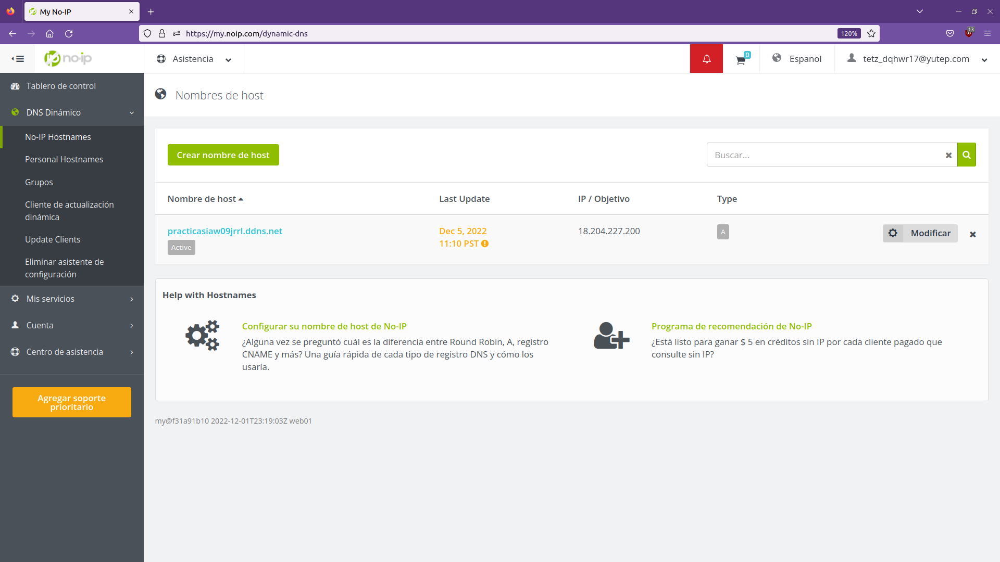
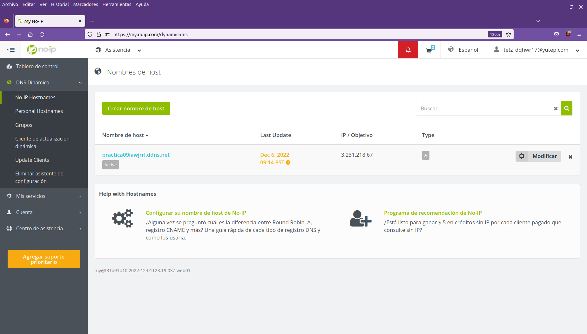
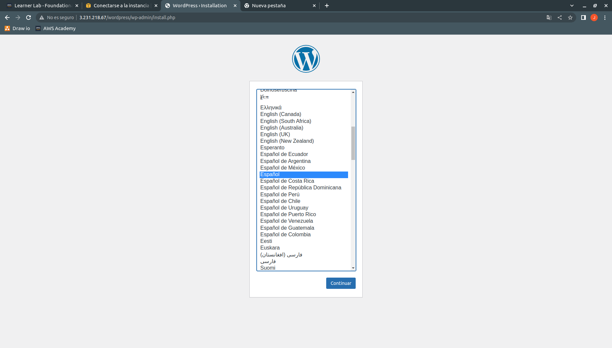
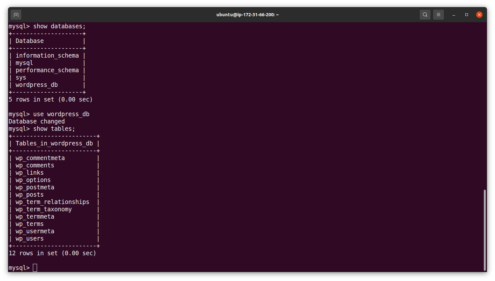
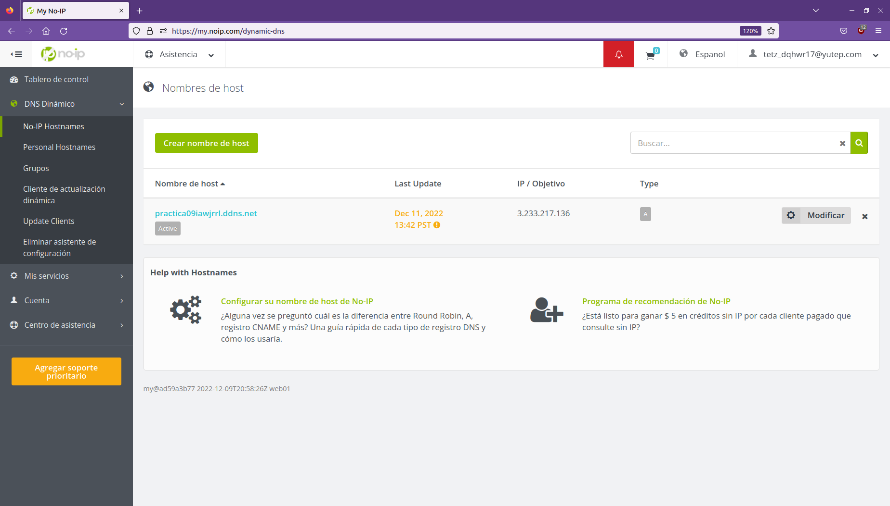
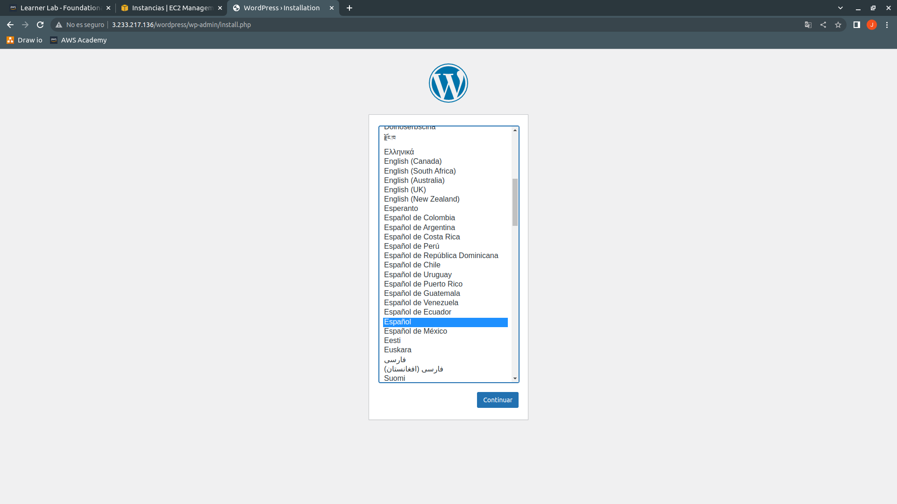
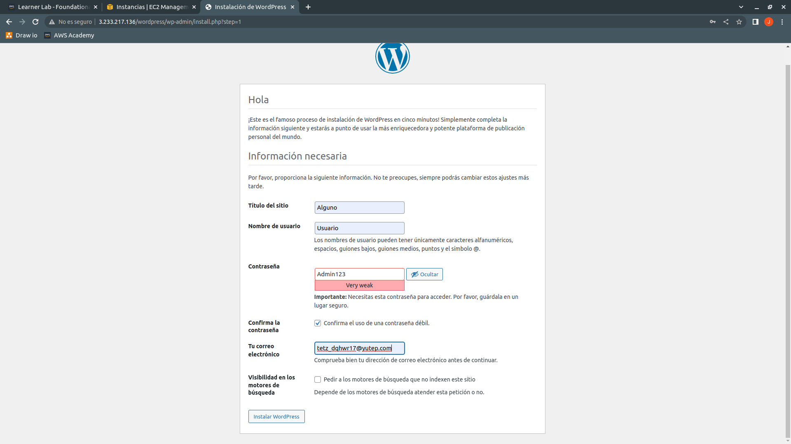
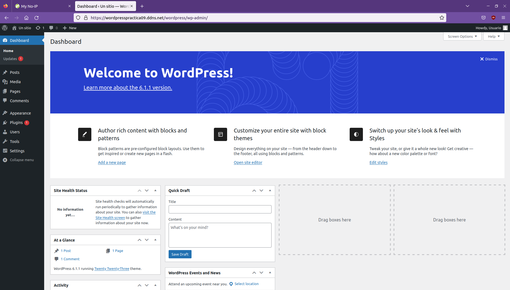

# iaw-practica-09

# Práctica 9 de IAW - Instalación de WordPress en distintos niveles

Esta práctica la realizaremos por fases, en la primera fase, fase-0, realizaremos la instalación de WordPress en un único nodo o instancia, en la segunda fase, fase-1, realizaremos la misma instalación en dos niveles, un frontend (servidor web Apache2) y un backend (servidor SQL), por último, en la tercera fase, fase-2, realizaremos la instalación de un balanceador de carga, dos frontend, un backend y un servidor NFS para almacenar datos compartidos para los dos frontend.

Los requisitos para las tres fases con una instancia **Ubuntu Server 22.04** o **Ubuntu Server 20.04** con **al menos 2GB de RAM**. Tendremos en cuenta los puertos de entrada en cada máquina que tendremos que abrir:

+ **Nodo único** --> HTTPS (puerto 443), HTTP (puerto 80) y SSH (puerto 22)

+ **Frontend sin balanceador de carga** --> HTTPS (puerto 443), HTTP (puerto 80) y SSH (puerto 22)

+ **Frontend con balanceador de carga** --> HTTP (puerto 80) y SSH (puerto 22)

+ **Backend** --> MySQL/Aurora (puerto 3306) y SSH (puerto 22)

+ **Balanceador de carga** --> HTTPS (puerto 443), HTTP (puerto 80) y SSH (puerto 22)

+ **NFS Server** --> NFS (puerto 2049) y SSH (puerto 22)

Prepararemos la siguiente estructura de directorios y archivos:

+ **fase-0**

    + **ansible**

        + **playbooks**

            + **deploy_wordpress.yml**

            + **https.yml**

            + **install_lamp.yml**

        + **templates**

            + **000-default.conf.j2**

            + **dir.conf.j2**

        + **vars**

            + **variables.yml**

        + **inventario** --> Archivo

        + **main.yml**

    + **scripting**

        + **conf**

            + **000-default.conf**

            + **dir.conf**

        + **scripts**

            + **config-https.sh**

            + **deploy_wordpress.sh**

            + **install_lamp.sh**

            + **variables.sh**

+ **fase-1**

    + **ansible**

        + **playbooks**

            + **deploy_backend.yml**

            + **deploy_wordpress.yml**

            + **https.yml**

            + **install_backend.yml**

            + **install_frontend.yml**

        + **templates**

            + **000-default.conf.j2**

            + **dir.conf.j2**

        + **vars**

            + **variables.yml**

        + **inventario** --> Archivo

        + **main.yml**

    + **scripting**

        + **conf**

            + **000-default.conf**

            + **dir.conf**

        + **scripts**

            + **deploy_backend.sh**

            + **deploy_wordpress.sh**

            + **https_frontend.sh**

            + **install_backend.sh**

            + **install_frontend.sh**

            + **variables.sh**

+ **fase-2**

    + **ansible**

        + **playbooks**

            + **deploy_backend.yml**

            + **deploy_balancer.yml**

            + **deploy_wordpress.yml**

            + **https.yml**

            + **install_backend.yml**

            + **install_frontend.yml**

            + **install_nfs_client.yml**

            + **install_nfs_server.yml**

        + **templates**

            + **000-default-balancer.conf.j2**

            + **000-default-frontend.conf.j2**

            + **dir.conf.j2**

            + **exports.j2**

        + **vars**

            + **variables.yml**

        + **inventario**

        + **main.yml**

    + **scripting**

        + **conf**

            + **000-default-balancer.conf**

            + **000-default-frontend.conf**

            + **dir.conf**

            + **exports**

        + **scripts**

            + **deploy_backend.sh**

            + **deploy_balancer.sh**

            + **deploy_wordpress.sh**

            + **https_balancer.sh**

            + **install_backend.sh**

            + **install_frontend.sh**

            + **install_nfs_client.sh**

            + **install_nfs_server.sh**

            + **variables.sh**

Crearemos un repositorio para la práctica.
## fase-0

Iniciaremos esta práctica explicando la primera fase, mediante scripting como con ansible.

Crearemos en No-IP un dominio asignado a una dirección IP.



### scripting

Una vez tengamos la estructura de directorios y archivos necesarios, empezaremos con los archivos que tenemos que nos sirven de plantillas para usar una configuración concreta en la instancia.

#### 000-default.conf

Este archivo lo necesitaremos para permitir la creación de archivos htaccess mediante **AllowOverride All** y permitir que el sitio web funcione correctamente.

```conf
<VirtualHost *:80>
    #ServerName www.example.org
    ServerAdmin webmaster@localhost
    DocumentRoot /var/www/html

    #LogLevel info ssl:warm

    <Directory "/var/www/html">
        AllowOverride All
    </Directory>

    ErrorLog ${APACHE_LOG_DIR}/error.log
    CustomLog ${APACHE_LOG_DIR}/access.log combined
</VirtualHost>
```

#### dir.conf

Con este archivo priorizaremos el archivo index.php sobre el resto de los archivos.

```conf
<IfModule mod_dir.c>
        DirectoryIndex index.php index.html index.cgi index.pl index.xhtml index.htm
</IfModule>
```

#### variables.sh

Este archivo nos permitirá tener variables globales para los scripts que las necesiten y no tener que cambiar el contenido de las variables en varios archivos.

```bash
DB_Name=wp_db
DB_User=wp_user
DB_Password=wp_pass

DB_Host=localhost

WP_Home=https://practicasiaw09jrrl.ddns.net
WP_SiteURL=https://practicasiaw09jrrl.ddns.net/wordpress

Certbot_Email=tetz_dqhwr17@yutep.com
Certbot_Domain=practicasiaw09jrrl.ddns.net
```

Las tres primeras líneas nos permiten establecer la base de datos con el usuario y la contraseña para ese usuario, la cuarta nos permite indicar dónde se encuentra la base de datos, en nuestro caso como está en la misma máquina será localhost. **La cuarta variable nos permite indicar el formato de la URL que queremos para nuestro sitio web**, **la quinta variable establece la ruta local dónde se encuentra la instalación de WordPress**, las dos últimas variables son para la obtención del certificado de Let's Encrypt usando Certbot.

#### install_lamp.sh

Instalaremos la pila LAMP en nuestra instancia, también copiaremos las dos plantillas a su respectiva ruta, habilitaremos el módulo rewrite para que WordPress pueda hacer cambios y reiniciaremos el servidor Apache2 para aplicar los cambios realizados.

```bash
apt-get update

apt-get upgrade -y

apt-get install apache2 -y

apt-get install mysql-server -y

apt-get install php libapache2-mod-php php-mysql -y
```

Como de costumbre, seguiremos los mismos pasos para la instalación de la pila LAMP.

```bash
cp ../conf/000-default.conf /etc/apache2/sites-available

cp ../conf/dir.conf /etc/apache2/mods-available

a2enmod rewrite

systemctl restart apache2
```

A continuación, **copiaremos la primera plantilla**, **000-default.conf** a la ruta **/etc/apache2/sites-available** para permitir el uso de archivos .htaccess y que nuestro sitio web funcione correctamente en cuanto al contenido servido. **Copiaremos la segunda plantilla**, **dir.conf** a la ruta **/etc/apache2/mods-available** para priorizar los archivos index según formato, luego habilitaremos el módulo rewrite de Apache y reiniciaremos el servidor web.

#### config-https.sh

Este segundo script nos permitirá la configuración del servidor para usar el protocolo HTTPS, tendremos que instalar Certbot mediante Snap y obtener el certificado de Let's Encrypt. Este script lo hemos realizado en prácticas anteriores, por lo que realizaré una explicación superficial del script

```bash
source variables.sh

snap install core

snap refresh core

apt-get remove Certbot

snap install --classic Certbot

ln -s /snap/bin/certbot /usr/bin/certbot

certbot --apache -m $Certbot_Email --agree-tos --no-eff-email -d $Certbot_Domain
```

Importaremos el archivo de variables e instalaremos Core mediante Snap, después actualizaremos Core y quitaremos la instalación por defecto de Certbot que viene con el sistema operativo, después instalaremos Certbot mediante Snap y solicitaremos el certificado de Let's Encrypt.

#### deploy_wordpress.sh

Con este script realizaremos el despliegue de WordPress en la instancia, necesitaremos descargar el código fuente de WordPress, así como Unzip, crear una base de datos, descomprimir los archivos en /var/www/html y personalizar WordPress.

```bash
source variables.sh

wget https://wordpress.org/latest.zip -O /tmp/latest.zip

apt install unzip -y

unzip /tmp/latest.zip -d /var/www/html

cp /var/www/html/wordpress/wp-config-sample.php /var/www/html/wordpress/wp-config.php

sed -i "s/database_name_here/$DB_Name/" /var/www/html/wordpress/wp-config.php

sed -i "s/username_here/$DB_User/" /var/www/html/wordpress/wp-config.php

sed -i "s/password_here/$DB_Password/" /var/www/html/wordpress/wp-config.php

sed -i "s/localhost/$DB_Host/" /var/www/html/wordpress/wp-config.php
```

En esta parte del script realizaremos la importación de las variables definidas, después descargaremos el código fuente de WordPress, instalaremos Unzip y descomprimiremos el contenido en /var/www/html, de forma que **en la ruta deberemos tener tanto index.html como un directorio llamado wordpress**.

A continuación, **copiaremos el archivo wp-config-sample.php en la misma ruta con distinto nombre para realizar modificaciones sobre la copia, wp-config.php**. Las modificaciones que deberemos hacer son la asignación de la base de datos, el usuario y su contraseña y la localización de la base de datos.

```bash
echo "DROP DATABASE IF EXISTS $DB_Name" | mysql -u root
echo "CREATE DATABASE $DB_Name CHARACTER SET utf8mb4" | mysql -u root

echo "DROP USER IF EXISTS $DB_User@'%'" | mysql -u root
echo "CREATE USER $DB_User@'%' IDENTIFIED BY '$DB_Password'" | mysql -u root
echo "GRANT ALL PRIVILEGES ON $DB_Name.* TO $DB_User@'%'" | mysql -u root

cp /var/www/html/wordpress/index.php /var/www/html

sed -i "s|wp-blog-header.php|wordpress/wp-blog-header.php|" /var/www/html/index.php

sed -i "/DB_COLLATE/a define('WP_HOME', '$WP_Home');" /var/www/html/wordpress/wp-config.php

sed -i "/WP_HOME/a define('WP_SITEURL', '$WP_SiteURL');" /var/www/html/wordpress/wp-config.php

chown www-data:www-data -R /var/www/html
```

Después, crearemos la base de datos junto al usuario y su contraseña y **copiaremos el archivo index.php para ponerlo en un nivel superior**, **en /var/www/html** para que en cuanto se acceda al dominio o a la dirección IP del servidor **se acceda directamente sin tener que referenciar el directorio de instalación de WordPress en el equipo**.

Por último, **modificaremos el index.php para hacer referencia a la localización del archivo wp-blog-header.php** y que nuestro WordPress funcione correctamente. También **modificaremos el contenido del archivo wp-config.php para añadir un par de líneas que indicarán el formato de URL que tendrá el sitio y la ruta interna a los archivos de WordPress**, además de cambiar el propietario y el grupo de html de forma recursiva.

### ansible

Realizaremos la misma parte mediante ansible, de forma que modificaremos lo realizado mediante scripting para ajustarlo al uso de Ansible.

#### variables.yml

En este archivo tendremos las variables para usarlas en los playbooks que las necesiten.

```yml
Certbot:
  Email: tetz_dqhwr17@yutep.com
  Domain: practicasiaw09jrrl.ddns.net

Template_000_default:
  Local_Source: ../templates/000-default.conf.j2
  DocumentRoot: /var/www/html

Template_dir:
  Local_Source: ../templates/dir.conf.j2
  Directory_index: DirectoryIndex index.php index.html index.cgi index.pl index.xhtml index.htm

PHP_Packages:
  - php
  - libapache2-mod-php
  - php-mysql

Database:
  Name: wordpress_db
  User: wordpress_user
  Password: wordpress_pass
  Host: localhost

WordPress:
  Home: http://practicasiaw09jrrl.ddns.net
  SiteURL: http://practicasiaw09jrrl.ddns.net/wordpress
```

Introduciremos las variables que necesitamos dentro de otra variable que será la global para tenerlas agrupadas por función o máquina dónde se ejecutarán. De esta forma evitamos tener variables sueltas y evitamos el caos resultante.

Las dos primeras variables nos servirán para la obtención del certificado de Let's Encrypt y poder usar HTTPS, la tercera indica la ruta local del template 000-default.conf.j2 y la cuarta el contenido de la variable de dicho template. La quinta indica la ruta local del template dir.conf.j2 y la sexta el contenido de la variable de dicho template, en la séptima variable indicamos los paquetes de PHP que hay que instalar.

Las siguientes cuatro variables son para indicar la base de datos, el usuario y su contraseña y la localización de la base de datos. Las dos últimas son para la personalización de la URL de WordPress y la ruta interna de los archivos de WordPress en el equipo.

#### 000-default.conf.j2

Al igual que hicimos con los scripts, crearemos una plantilla o template para copiar el template en el equipo local al equipo remoto y haremos unas modificaciones mediante variables, que en este caso, **tenemos que hacer referencia a la variable global seguido de un punto (o dot) seguido de la variable que tiene el contenido que necesitamos**.

```j2
<VirtualHost *:80>
    #ServerName www.example.org
    ServerAdmin webmaster@localhost
    DocumentRoot {{ Template_000_default.DocumentRoot }}

    #LogLevel info ssl:warm

    <Directory "{{ Template_000_default.DocumentRoot }}">
        AllowOverride All
    </Directory>

    ErrorLog ${APACHE_LOG_DIR}/error.log
    CustomLog ${APACHE_LOG_DIR}/access.log combined
</VirtualHost>
```

El contenido del template es lo mismo, salvo que usaremos una variable para definir el directorio de localización de WordPress y si fuese necesario podríamos modificar el contenido de la variable sin tener que modificar el template.

#### dir.conf.j2

Al igual que con el scripting, priorizaremos las extensiones de los archivos index para que primero se nos muestre primero el index.php sobre el index.html.

```j2
<IfModule mod_dir.c>
        {{ Template_dir.Directory_index }}
</IfModule>
```

#### inventario

Definiremos los parámetros globales para el usuario de la instancia, la localización de la clave privada de la instancia en el equipo local y que no nos pregunte si queremos añadir el fingerprint o huella de la máquina. También especificaremos el grupo wordpress y la dirección IP que tiene la instancia en el momento de crearla o la dirección IP elástica si asignamos una a la instancia.

```
[wordpress]
18.204.227.200

[wordpress:vars]
ansible_user=ubuntu
ansible_ssh_private_key_file=/home/rayseink/claves/vockey.pem
ansible_ssh_common_args='-o StrictHostKeyChecking=accept-new'
```

#### install_lamp.yml

Realizaremos la instalación de la pila LAMP y pasaremos los templates al equipo remoto, habilitaremos el módulo rewrite y reiniciaremos el servidor Apache2.

```yml
---
- name: Playbook para el despliegue de la pila LAMP
  hosts: wordpress
  become: true

  tasks:
    - name: Inclusión de variables para los templates
      ansible.builtin.include_vars:
        ../vars/variables.yml

    - name: Actualización de los repositorios
      ansible.builtin.apt:
        update_cache: true
        upgrade: true

    - name: Instalación del servidor web Apache2
      ansible.builtin.apt:
        name: apache2
        state: present

    - name: Instalación del servidor de bases de datos
      ansible.builtin.apt:
        name: mysql-server
        state: present

    - name: Instalación de PHP y módulos para conectar con la base de datos y Apache2
      ansible.builtin.apt:
        name: "{{ PHP_Packages }}"
        state: present
```

Hasta aquí es la inclusión del archivo de variables en el playbook para los dos templates que vamos a pasar al servidor, la actualización de los repositorios y los programas con respecto a los repositorios, la instalación de Apache2, MySQL Server y los paquetes de PHP.

```yml
    - name: Copiado del template 000-default.conf.j2 a la ruta /etc/apache2/sites-available
      ansible.builtin.template:
        src: "{{ Template_000_default.Local_Source }}"
        dest: /etc/apache2/sites-available/000-default.conf
        mode: 0644

    - name: Copiado del template dir.conf.j2 a la ruta /etc/apache2/mods-available
      ansible.builtin.template:
        src: "{{ Template_dir.Local_Source }}"
        dest: /etc/apache2/mods-available/dir.conf
        mode: 0644

    - name: Habilitación del módulo rewrite de Apache2
      community.general.apache2_module:
        name: rewrite
        state: present
      notify: Reiniciar servidor Apache2

  handlers:
    - name: Reiniciar servidor Apache2
      ansible.builtin.service:
        name: apache2
        state: restarted
```

**Usaremos el módulo ansible.builtin.template para pasar los templates locales al servidor** y habilitaremos el módulo rewrite de Apache2 para que WordPress pueda realizar cambios en el servidor web, por último reiniciaremos Apache2 para que se apliquen los cambios.

#### https.yml

Con este playbook realizaremos la descarga de Certbot y la obtención del certificado de Let's Encrypt para poder usar HTTPS en nuestro servidor.

```yml
---
- name: Descarga de Certbot mediante Snap y obtención de certificado de Let's Encrypt
  hosts: wordpress
  become: true

  tasks:
    - name: Inclusión del archivo de variables
      ansible.builtin.include_vars:
        ../vars/variables.yml

    - name: Desinstalación de la instalación previa de Certbot que viene con el sistema operativo
      ansible.builtin.apt:
        name: certbot
        state: absent

    - name: Instalación de Certbot mediante Snap
      community.general.snap:
        name: certbot
        classic: true
        state: present

    - name: Descarga de certificado para TLS / SSL
      ansible.builtin.command: certbot --apache -m "{{ Certbot_Email }}" --agree-tos --no-eff-email -d "{{ Certbot_Domain }}"
      register: realizar_cambio
      changed_when: realizar_cambio.rc == 0
```

Incluiremos el archivo de variables en el playbook y desinstalaremos Certbot que viene con el sistema operativo, después instalaremos mediante Snap la versión correcta de Certbot y obtendremos el certificado de Let's Encrypt.

#### deploy_wordpress.yml

Realizaremos el despliegue de WordPress en el equipo remoto, crearemos una base de datos con un usuario y una contraseña y haremos las modificaciones pertinentes para WordPress.

```yml
---
- name: Despliegue de WordPress en un único nodo
  hosts: wordpress
  become: true

  tasks:
    - name: Inclusión del archivo de variables
      ansible.builtin.include_vars:
        ../vars/variables.yml

    - name: Instalación de Unzip para descomprimir archivos
      ansible.builtin.apt:
        name: unzip
        state: present

    - name: Descarga del código fuente de WordPress en directorio temporal
      ansible.builtin.get_url:
        url: https://wordpress.org/latest.zip
        dest: /tmp/wordpress.zip
        mode: 664

    - name: Descompresión de WordPress en /var/www/html
      ansible.builtin.unarchive:
        src: /tmp/wordpress.zip
        dest: /var/www/html
        remote_src: true

    - name: Borrado del archivo comprimido en el directorio temporal
      ansible.builtin.file:
        path: /tmp/wordpress.zip
        state: absent

    - name: Copiado de archivo wp-config-sample.php a wp-config.php
      ansible.builtin.copy:
        src: /var/www/html/wordpress/wp-config-sample.php
        dest: /var/www/html/wordpress/wp-config.php
        mode: 0644
        remote_src: true
```

Empezaremos incluyendo el archivo de variables en el playbook, después instalaremos Unzip para la descompresión de archivos, descargaremos el código fuente de WordPress en el directorio temporal, descomprimiremos el archivo de WordPress en /var/www/html, borraremos el archivo comprimido que contiene WordPress y copiaremos el archivo wp-config-sample.php en la misma ruta para modificar el nombre del archivo a wp-config.php **usando el módulo ansible.builtin.copy y con la opción remote_src: true para indicar que es en el equipo remoto**.

```yml
    - name: Modificación del archivo wp-config.php para especificar la base de datos
      ansible.builtin.replace:
        path: /var/www/html/wordpress/wp-config.php
        regexp: database_name_here
        replace: "{{ Database.Name }}"

    - name: Modificación del archivo wp-config.php para especificar el usuario de la base de datos
      ansible.builtin.replace:
        path: /var/www/html/wordpress/wp-config.php
        regexp: username_here
        replace: "{{ Database.User }}"

    - name: Modificación del archivo wp-config.php para especificar la contraseña del usuario
      ansible.builtin.replace:
        path: /var/www/html/wordpress/wp-config.php
        regexp: password_here
        replace: "{{ Database.Password }}"

    - name: Modificación del archivo wp-config.php para especificar el servidor de la base de datos
      ansible.builtin.replace:
        path: /var/www/html/wordpress/wp-config.php
        regexp: localhost
        replace: "{{ Database.Host }}"
```

Modificaremos el archivo wp-config.php para indicar la base de datos, el usuario de la base de datos y su contraseña, además de la conexión a la base de datos, que en este caso es localhost.

```yml
    - name: Instalación del gestor de paquetes de Python3
      ansible.builtin.apt:
        name: python3-pip
        state: present

    - name: Instalación del módulo PyMySQL mediante el gestor de paquetes de Python3 para conectar conectar con el socket
      ansible.builtin.pip:
        name: pymysql
        state: present

    - name: Creación de la base de datos usando el socket de PyMySQL
      community.mysql.mysql_db:
        name: "{{ Database.Name }}"
        state: present
        login_unix_socket: /run/mysqld/mysqld.sock

    - name: Creación del usuario con la contraseña para la base de datos
      no_log: true
      community.mysql.mysql_user:
        name: "{{ Database.User }}"
        host: '%'
        password: "{{ Database.Password }}"
        priv: "{{ Database.Name }}.*:ALL"
        state: present
        login_unix_socket: /run/mysqld/mysqld.sock
```

A continuación, crearemos la base de datos con el usuario y la contraseña, para ello, **necesitamos instalar en el equipo remoto el gestor de paquetes de Python3 y el módulo PyMySQL**. Para la base de datos con el usuario y contraseña **necesitaremos usar el socket de MySQL (mysqld.sock) que se encuentra en /run/mysqld** para poder realizar las operaciones pertinentes **usando el módulo PyMySQL**.

```yml
    - name: Copiado del archivo index.php de html/wordpress a html
      ansible.builtin.copy:
        src: /var/www/html/wordpress/index.php
        dest: /var/www/html/index.php
        mode: 0644
        remote_src: true

    - name: Modificación del archivo index.php para la redirección a WordPress
      ansible.builtin.replace:
        path: /var/www/html/index.php
        regexp: wp-blog-header.php
        replace: wordpress/wp-blog-header.php

    - name: Modificación del archivo wp-config.php para la personalización de la URL
      ansible.builtin.blockinfile:
        path: /var/www/html/wordpress/wp-config.php
        insertafter: DB_COLLATE
        block: |
          define('WP_HOME', '{{ WordPress.Home }}');
          define('WP_SITEURL', '{{ WordPress.SiteURL }}');

    - name: Cambio de propietario y grupo para /var/www/html
      ansible.builtin.file:
        path: /var/www/html
        owner: www-data
        group: www-data
        recurse: true

      notify: Reinicio de Apache2

  handlers:
    - name: Reinicio de Apache2
      ansible.builtin.service:
        name: apache2
        state: restarted
```

Para finalizar con el playbook, **subiremos un nivel el archivo index.php que se encuentra en /var/www/html/wordpress** y lo modificaremos para **indicar la ruta al archivo wp-blog-header.php que se encuentra en el directorio wordpress**. También modificaremos el archivo wp-config.php para personalizar la URL de WordPress y evitar que aparezca el directorio dónde se ubica, **usaremos el módulo ansible.builtin.blockinfile**, indicaremos la ruta del archivo y que **vamos a añadir un bloque de código después de la línea que contenga DB_COLLATE con insertafter** y **con block las líneas que queremos añadir**, la primera para indicar el formato de la URL y la segunda la ubicación interna de WordPress.

A continuación, cambiaremos el propietario y el grupo de la ruta /var/www/html de forma recursiva y provocaremos el reinicio de Apache2 mediante notify y el handler correspondiente.

#### main.yml

Este archivo será el que importará los playbooks y el que ejecutemos para realizar la instalación de la pila LAMP, la configuración para HTTPS y el despliegue de WordPress. Usaremos tags para cada importación de playbook ya que **si queremos evitar que un playbook o playbooks se ejecuten tenemos que hacer referencia al tag o tags que no queremos que se ejecuten**, como por ejemplo el playbook https, **también podemos hacer el caso contrario de ejecutar un playbook o playbooks mediante el tag o tags**, los tags también nos permiten referenciar cada task o playbook para su identificación.

```yml
---

- name: Importación de playbook para instalar la pila LAMP
  ansible.builtin.import_playbook:
    playbooks/install_lamp.yml
  tags: lamp

- name: Importación de playbook para preparar HTTPS
  import_playbook:
    playbooks/https.yml
  tags: certificado

- name: Importación de playbook para el despliegue de wordpress
  ansible.builtin.import_playbook:
    playbooks/deploy_wordpress.yml
  tags: wordpress
```

El orden de ejecución es primero pila LAMP, **después la obtención del certificado de Let's Encrypt ya que para este playbook necesitamos tener instalado Apache** y por último el despliegue de WordPress.

#### Comprobación del despliegue de WordPress en un nivel

Como tenemos dos formas de realizar esta fase, escogeremos la que queramos, podemos hacerlo mediante scripting que deberemos clonar el repositorio en el que hemos realizado los scripts al equipo en el que instalaremos WordPress o con ansible desde nuestro equipo local lanzando el archivo main.yml.

**Debemos tener en cuenta el orden de ejecución de los scripts y de los playbooks**, por ejemplo, **para obtener el certificado de Let's Encrypt, necesitamos que la máquina tenga instalado el servidor Apache**.

Mediante scripting tenemos que **ejecutar los scripts en el siguiente orden** y **en la ruta dónde se encuentran**:

> **sudo ./install_lamp.sh**
>
> **sudo ./config-https.sh**
>
> **sudo ./deploy_wordpress.sh**

Mediante ansible **en la ruta dónde se encuentra el archivo inventario y main.yml**:

> **ansible-playbook -i inventario main.yml**

De la forma anterior con Ansible ejecutamos todos los playbooks y en el caso de que queramos saltar un playbook, como por ejemplo la instalación de Certbot mediante Snap y la descarga del certificado de Let's Encrypt, usaremos:

> **ansible-playbook -i inventario main.yml --skip-tags certificado**

Para el caso contrario, sólo tenemos que ejecutar:

> **ansible-playbook -i inventario main.yml --tags [lamp, wordpress]**

Una vez lancemos la instalación de una forma u otra, cuando termine la ejecución, accederemos a través de un navegador web a la dirección IP de la instancia o mediante el dominio que hemos asignado.


Nos saldrá el idioma que queremos para nuestro WordPress, lo escogemos y pasamos al siguiente paso.


Cuando terminemos de poner los datos que nos piden, pulsaremos en el botón Instalar WordPress.


Cuando hayamos accedido al backoffice, usaremos el dominio en una pestaña nueva para comprobar que funciona correctamente.

## fase-1

Para esta fase necesitaremos dos equipos, un frontend y un backend, en este caso como no necesitamos balanceador de carga, por lo que tendremos que abrir los puertos de HTTPS, HTTP y SSH en la máquina frontend.

Crearemos un nuevo dominio y asignaremos la dirección IP pública de la máquina frontend o asignaremos una dirección IP elástica a la máquina y asignaremos la IP al dominio en No-IP.



Parte de los archivos que hemos usado en la anterior fase los reutilizaremos y el resto los modificaremos y partiremos el contenido para adecuarlo a los dos niveles de esta parte.

### scripting

Los archivos **variables.sh, config-https.sh, 000-default.conf y dir.conf los reutilizaremos** y en el caso de **config-https.sh lo renombraremos a https_frontend.sh** ya que tenemos que obtener el certificado de Let's Encrypt en la máquina frontend. Modificaremos el contenido de ambos scripts para que se adecúen a las dos nuevas máquinas que tenemos que crear. Los demás scripts los partiremos para que cada máquina realice su función.

En el **archivo variables.sh hay una línea que tenemos que modificar**.

```bash
DB_Host=172.31.66.200

Certbot_Domain=practica09iawjrrl.ddns.net
WP_Home=https://practica09iawjrrl.ddns.net
WP_SiteURL=https://practica09iawjrrl.ddns.net/wordpress
```

**En la variable DB_Host tenemos que poner la dirección IP privada de la máquina backend** ya que es la que tendrá el servidor MySQL para la base de datos con el usuario y la contraseña, **también podemos modificar el dominio de las variables Certbot_Domain, WP_Home y WP_SiteURL**.

#### install_frontend.sh

En esta máquina tenemos que actualizar los repositorios y los programas instalados, instalar el servidor web Apache y los paquetes relacionados con PHP, además de copiar las plantillas a sus respectivos directorios, habilitar el módulo rewrite y reiniciar el servidor web para aplicar los cambios. Deberá quedar de la siguiente manera:

```bash
apt-get update

apt-get upgrade -y

apt-get install apache2 -y

apt-get install php libapache2-mod-php php-mysql -y

cp ../conf/000-default.conf /etc/apache2/sites-available

cp ../conf/dir.conf /etc/apache2/mods-available

a2enmod rewrite

systemctl restart apache2
```

En la máquina **frontend no instalaremos el servidor de bases de datos MySQL** ya que esta instalación la realizaremos en la máquina backend.

#### install_backend.sh

En esta máquina tendremos que actualizar los repositorios y los programas con respecto a los repositorios instalados y realizar la instalación de MySQL y cambiar el Bind-Address para aceptar conexiones de otras máquinas.

```bash
apt-get update

apt-get upgrade -y

apt-get install mysql-server

sed -i 's/127.0.0.1/0.0.0.0/' /etc/mysql/mysql.conf.d/mysqld.cnf

systemctl restart mysql
```

Como esta máquina será la que tenga la base de datos de WordPress, tendremos que instalar MySQL y hacer un cambio en el Bind-Address para que acepte conexiones de nuestra máquina frontend. Para finalizar, tendremos que reiniciar MySQL para que los cambios se apliquen.

#### deploy_wordpress.sh

Usaremos este script para descargar y desplegar WordPress en la máquina frontend, de forma que tendremos que realizar cambios en el archivo wp-config.php para especificar el nombre de la base de datos, el usuario a usar y su contraseña, también debemos especificar la máquina en la que se encuentra MySQL.

```bash
source variables.sh

wget https://wordpress.org/latest.zip -O /tmp/latest.zip

apt install unzip -y

unzip /tmp/latest.zip -d /var/www/html

cp /var/www/html/wordpress/wp-config-sample.php /var/www/html/wordpress/wp-config.php

sed -i "s/database_name_here/$DB_Name/" /var/www/html/wordpress/wp-config.php

sed -i "s/username_here/$DB_User/" /var/www/html/wordpress/wp-config.php

sed -i "s/password_here/$DB_Password/" /var/www/html/wordpress/wp-config.php

sed -i "s/localhost/$DB_Host/" /var/www/html/wordpress/wp-config.php

cp /var/www/html/wordpress/index.php /var/www/html

sed -i "s|wp-blog-header.php|wordpress/wp-blog-header.php|" /var/www/html/index.php

sed -i "/DB_COLLATE/a define('WP_HOME', '$WP_Home');" /var/www/html/wordpress/wp-config.php

sed -i "/WP_HOME/a define('WP_SITEURL', '$WP_SiteURL');" /var/www/html/wordpress/wp-config.php

chown www-data:www-data -R /var/www/html
```

En este script tenemos que importar el archivo de variables e iniciar la descarga del código fuente de WordPress, instalar Unzip y descomprimir el contenido de WordPress descargado en la máquina en el directorio /var/www/html, después cambiaremos el nombre del archivo wp-config-sample.php a wp-config.php para que coja la configuración del archivo que vamos a modificar para especificar la base de datos, el usuario, su contraseña y la ubicación de la base de datos. Después subiremos un nivel el archivo index.php para ubicarlo en /var/www/html.

Modificaremos el index.php para especificar la ubicación del archivo wp-blog-header.php que se encuentra en /var/www/html/wordpress y volveremos a modificar el archivo wp-config.php para añadir dos líneas, la primera nos permite especificar la URL que tendrá el sitio web y la segunda la ubicación interna de los archivos de WordPress. Por último, modificaremos el propietario y el grupo de los archivos y directorios que se encuentran en /var/www/html de forma recursiva a Apache.

#### deploy_backend.sh

Este script lo usaremos para crear la base de datos en el equipo backend.

```bash
source variables.sh

echo "DROP DATABASE IF EXISTS $DB_Name" | mysql -u root
echo "CREATE DATABASE $DB_Name CHARACTER SET utf8mb4" | mysql -u root

echo "DROP USER IF EXISTS $DB_User@'%'" | mysql -u root
echo "CREATE USER $DB_User@'%' IDENTIFIED BY '$DB_Password'" | mysql -u root
echo "GRANT ALL PRIVILEGES ON $DB_Name.* TO $DB_User@'%'" | mysql -u root
```

Importaremos el archivo de variables y crearemos tanto la base de datos con el usuario y la contraseña, también especificaremos los privilegios que tendrá el usuario con respecto la base de datos, en este caso tendrá todos los privilegios.

### ansible

En este caso también **reutilizaremos los archivos variables.yml**, **000-default.conf.j2**, **dir.conf.j2** y **https.yml**, **en el caso del archivo variables.yml tendremos que modificar el contenido de algunas de las variables que tenemos para adecuarlas a las máquinas** y **en el caso de https.yml tenemos que modificar la línea de hosts para que se ejecute en la máquina frontend**.

#### variables.yml

**Modificaremos el contenido de las siguientes variables para adecuarlo a la nueva fase, siendo opcionales tanto Domain, Home y SiteURL**.

```yml
Host: 172.31.66.200

Domain: practica09iawjrrl.ddns.net
Home: https://practicasiaw09jrrl.ddns.net
SiteURL: https://practicasiaw09jrrl.ddns.net/wordpress
```

**En la variable Host tenemos que poner la dirección IP privada de la máquina que tendrá el servidor de bases de datos**.

#### inventario

En este archivo definiremos dos grupos, uno para la máquina frontend y otro para la máquina backend.

```
[frontend]
3.231.218.67

[backend]
35.168.113.213

[all:vars]
ansible_user=ubuntu
ansible_ssh_private_key_file=/home/rayseink/claves/vockey.pem
ansible_ssh_common_args='-o StrictHostKeyChecking=accept-new'
```

Como necesitamos hacer la ejecución de cada playbook en su máquina correspondiente, tenemos que tener dos grupos en nuestro archivo de inventario y con la dirección IP pública de la máquina en su respectivo grupo. Por último, tenemos que usar **all:vars** para que la configuración global la coja todos los grupos de máquinas que hemos especificado.

#### install_frontend.yml

Al igual que hicimos con los scripts, tenemos que instalar en la máquina frontend el servidor Apache, PHP y sus respectivos módulos, copiar los templates locales a la máquina remota, habilitar el módulo rewrite para que WordPress pueda realizar cambios en el servidor web y reiniciar el servidor web.

```yml
---
- name: Instalación de Apache y PHP para el equipo frontend
  hosts: frontend
  become: true

  tasks:
    - name: Inclusión de archivo de variables
      ansible.builtin.include_vars:
        ../vars/variables.yml

    - name: Actualización de los repositorios y de los programas instalados
      ansible.builtin.apt:
        update_cache: true
        upgrade: true

    - name: Instalación de servidor web Apache
      ansible.builtin.apt:
        name: apache2
        state: present

    - name: Instalación de PHP y módulos de PHP para conectar con la base de datos y Apache
      ansible.builtin.apt:
        name: "{{ PHP_Packages }}"
        state: present

    - name: Copiado de template 000-default.conf.j2 al equipo remoto
      ansible.builtin.template:
        src: "{{ Template_000_default.Local_Source }}"
        dest: /etc/apache2/sites-available/000-default.conf
        mode: 0644

    - name: Copiado de template dir.conf.j2 al equipo remoto
      ansible.builtin.template:
        src: "{{ Template_dir.Local_Source }}"
        dest: /etc/apache2/mods-available/dir.conf
        mode: 0644

    - name: Habilitación del módulo rewrite de Apache
      community.general.apache2_module:
        name: rewrite
        state: present
      notify: Reiniciar servidor Apache

  handlers:
    - name: Reiniciar servidor Apache
      ansible.builtin.service:
        name: apache2
        state: restarted
```

**Tenemos que especificar en hosts el grupo en el que se ejecutará este playbook** y como hicimos con los scripts, realizaremos los cambios pertinentes para preparar la máquina frontend.

#### install_backend.yml

En este playbook tenemos que instalar MySQL y modificar el Bind-Address para que acepte conexiones de la red y reiniciar el servidor de bases de datos para que aplique el cambio realizado.

```yml
---
- name: Instalación de MySQL Server y cambio de Bind-Address
  hosts: backend
  become: true

  tasks:
    - name: Actualización de los repositorios y de los programas instalados
      ansible.builtin.apt:
        update_cache: true
        upgrade: true

    - name: Instalación de MySQL Server
      ansible.builtin.apt:
        name: mysql-server
        state: present

    - name: Cambio de Bind-Address para conectar con el equipo frontend
      ansible.builtin.replace:
        path: /etc/mysql/mysql.conf.d/mysqld.cnf
        regexp: 127.0.0.1
        replace: 0.0.0.0
      notify: Reiniciar servidor MySQL

  handlers:
    - name: Reiniciar servidor MySQL
      ansible.builtin.service:
        name: mysql
        state: restarted
```

Al igual que hicimos con el anterior playbook, **tenemos que especificar en hosts el grupo en el que se ejecutará este playbook**.

#### https.yml

**Este archivo lo tenemos que ejecutar en la máquina frontend**, de forma que modificaremos la línea de hosts para que se ejecute en el grupo frontend del archivo inventario.

```yml
---
- name: Descarga de Certbot mediante Snap y obtención de certificado de Let's Encrypt
  hosts: frontend
  become: true

  tasks:
    - name: Inclusión del archivo de variables
      ansible.builtin.include_vars:
        ../vars/variables.yml

    - name: Desinstalación de la instalación previa de Certbot que viene con el sistema operativo
      ansible.builtin.apt:
        name: certbot
        state: absent

    - name: Instalación de Certbot mediante Snap
      community.general.snap:
        name: certbot
        classic: true
        state: present

    - name: Descarga de certificado para TLS / SSL
      ansible.builtin.command: certbot --apache -m "{{ Certbot.Email }}" --agree-tos --no-eff-email -d "{{ Certbot.Domain }}"
      register: realizar_cambio
      changed_when: realizar_cambio.rc == 0
      when: certificado | d(False) == "descargar"
```

**Usaremos para evitar la ejecución de la descarga del certificado de Let's Encrypt el Statement When**, pondremos el When al mismo nivel y justamente después de la tarea concreta y **usaremos una variable**, **certificado que por defecto no se ejecutará hasta que el contenido de la variable sea "descargar"**.

#### deploy_wordpress.yml

Este playbook lo ejecutaremos en la máquina frontend y nos servirá para descargar el código fuente de WordPress, descomprimirlo y conectar con la base de datos que se encuentra en el equipo backend. 

```yml
---
- name: Despliegue de WordPress en el equipo frontend
  hosts: frontend
  become: true

  tasks:
    - name: Inclusión de archivo de variables
      ansible.builtin.include_vars:
        ../vars/variables.yml

    - name: Instalación de Unzip
      ansible.builtin.apt:
        name: unzip
        state: present

    - name: Descarga del código fuente de WordPress
      ansible.builtin.get_url:
        url: https://wordpress.org/latest.zip
        dest: /tmp/wordpress.zip
        mode: 0664

    - name: Descompresión de la descarga de WordPress
      ansible.builtin.unarchive:
        src: /tmp/wordpress.zip
        dest: /var/www/html
        remote_src: true

    - name: Borrado del archivo comprimido de WordPress
      ansible.builtin.file:
        path: /tmp/wordpress.zip
        state: absent

    - name: Copiado de archivo wp-config-sample.php a wp-config.php
      ansible.builtin.copy:
        src: /var/www/html/wordpress/wp-config-sample.php
        dest: /var/www/html/wordpress/wp-config.php
        mode: 0644
        remote_src: true

    - name: Modificación del archivo wp-config.php para especificar la base de datos
      ansible.builtin.replace:
        path: /var/www/html/wordpress/wp-config.php
        regexp: database_name_here
        replace: "{{ Database.Name }}"

    - name: Modificación del archivo wp-config.php para especificar el usuario de la base de datos
      ansible.builtin.replace:
        path: /var/www/html/wordpress/wp-config.php
        regexp: username_here
        replace: "{{ Database.User }}"

    - name: Modificación del archivo wp-config.php para especificar la contraseña del usuario
      ansible.builtin.replace:
        path: /var/www/html/wordpress/wp-config.php
        regexp: password_here
        replace: "{{ Database.Password }}"

    - name: Modificación del archivo wp-config.php para especificar el servidor de la base de datos
      ansible.builtin.replace:
        path: /var/www/html/wordpress/wp-config.php
        regexp: localhost
        replace: "{{ Database.Host }}"

    - name: Copiado del archivo index.php de html/wordpress a html
      ansible.builtin.copy:
        src: /var/www/html/wordpress/index.php
        dest: /var/www/html/index.php
        mode: 0644
        remote_src: true

    - name: Modificación del archivo index.php para la redirección a WordPress
      ansible.builtin.replace:
        path: /var/www/html/index.php
        regexp: wp-blog-header.php
        replace: wordpress/wp-blog-header.php

    - name: Modificación del archivo wp-config.php para la personalización de la URL
      ansible.builtin.blockinfile:
        path: /var/www/html/wordpress/wp-config.php
        insertafter: DB_COLLATE
        block: |
          define('WP_HOME', '{{ WordPress.Home }}');
          define('WP_SITEURL', '{{ WordPress.SiteURL }}');
    - name: Cambio de propietario y grupo para /var/www/html
      ansible.builtin.file:
        path: /var/www/html
        owner: www-data
        group: www-data
        recurse: true

      notify: Reinicio de Apache2

  handlers:
    - name: Reinicio de Apache2
      ansible.builtin.service:
        name: apache2
        state: restarted
```

#### deploy_backend.yml

Con este último playbook, crearemos la base de datos junto al usuario y su contraseña en la máquina backend.

```yml
---
- name: Despliegue de la base de datos para WordPress en el equipo backend
  hosts: backend
  become: true

  tasks:
    - name: Inclusión del archivo de variables
      ansible.builtin.include_vars:
        ../vars/variables.yml

    - name: Instalación del gestor de paquetes de Python3
      ansible.builtin.apt:
        name: python3-pip
        state: present

    - name: Instalación del módulo PyMySQL mediante el gestor de paquetes de Python3 para conectar conectar con el socket
      ansible.builtin.pip:
        name: pymysql
        state: present

    - name: Creación de la base de datos usando el socket de PyMySQL
      community.mysql.mysql_db:
        name: "{{ Database.Name }}"
        state: present
        login_unix_socket: /run/mysqld/mysqld.sock

    - name: Creación del usuario con la contraseña para la base de datos
      no_log: true
      community.mysql.mysql_user:
        name: "{{ Database.User }}"
        host: '%'
        password: "{{ Database.Password }}"
        priv: "{{ Database.Name }}.*:ALL"
        state: present
        login_unix_socket: /run/mysqld/mysqld.sock
```

#### main.yml

En este archivo principal importaremos los playbooks para ejecutarlos.

```yml
---

- name: Importación del playbook de instalación para el equipo frontend
  ansible.builtin.import_playbook:
    playbooks/install_frontend.yml

- name: Importación del playbook de instalación para el equipo backend
  ansible.builtin.import_playbook:
    playbooks/install_backend.yml

- name: Importación del playbook de obtención del certificado de Let's Encrypt
  ansible.builtin.import_playbook:
    playbooks/https.yml

- name: Importación del playbook para el despliegue en el equipo frontend
  ansible.builtin.import_playbook:
    playbooks/deploy_wordpress.yml

- name: Importación del playbook para el despliegue en el equipo backend
  ansible.builtin.import_playbook:
    playbooks/deploy_backend.yml
```

#### Comprobación del despliegue de WordPress en dos niveles

Ejecutaremos bien los scripts concretos en los equipos clonando el repositorio en ambas máquinas o lanzaremos el archivo principal y el inventario mediante ansible para preparar e instalar WordPress en dos niveles. Lo mejor es montar la arquitectura mediante ansible.

Mediante scripts tenemos que acceder a las máquinas mediante SSH y clonar el repositorio en ambas máquinas y acceder a la fase-1 al directorio scripts.

**Deberemos tener en cuenta que hay scripts o playbooks que tienen que ejecutarse unos antes que otros**, de forma que seguiremos el siguiente orden establecido para que funcione correctamente, por ejemplo, **para obtener el certificado de Let's Encrypt necesitamos que la máquina en la que se va a descargar tenga el servidor Apache instalado**.

**En la máquina frontend tenemos que ejecutar en el siguiente orden**:

> **sudo ./install_frontend.sh**
>
> **sudo ./https_frontend.sh**
>
> **sudo ./deploy_wordpress.sh**

**En la máquina backend tenemos que ejecutar en el siguiente orden**:

> **sudo ./install_backend.sh**
>
> **sudo ./deploy_backend.sh**

Mediante ansible **tenemos que dirigirnos en la máquina local al directorio fase-1**, **dónde se encuentra tanto inventario como main.yml**.

**Con el siguiente comando evitamos ejecutar en el playbook https**, **la última tarea que consiste en la descarga del certificado de Let's Encrypt**, que nos sirve para ejecuciones posteriores de los playbooks en las mismas máquina y siempre que una tenga un certificado de Let's Encrypt, ya que dejaría bloqueado el proceso de descarga del certificado al disponer la máquina de uno.

> **ansible-playbook -i inventario main.yml**

Para nuestra primera vez con esta fase necesitamos que nuestro frontend tenga el certificado, por lo que tenemos que ejecutar:

> **ansible-playbook -i inventario main.yml --extra-vars "certificado=descargar"**

Una vez hayamos finalizado, accederemos mediante la dirección IP pública o el nombre de dominio que hemos preparado en un navegador web.



Escogeremos el idioma que queramos y continuaremos.


Introduciremos el nombre del sitio, el usuario de acceso al BackOffice junto a su contraseña y el email y pulsaremos en el botón de Instalar WordPress.


Una vez hayamos terminado de instalar WordPress, introduciremos el nombre de dominio y comprobaremos que funciona correctamente el TLS.



Si queremos comprobar que en nuestro equipo backend tenemos la base de datos, accederemos mediante SSH a la instancia y ejecutaremos el comando **sudo mysql -u root**, después usaremos **show databases;** y veremos las bases de datos que tenemos, accederemos a nuestra base de datos que hemos definido en el archivo de variables mediante ansible o scripting mediante **use nombre_base_datos**, **siendo en mi caso use wordpress_db** y usaremos **show tables;** para mostrar las tablas de la base de datos, como no hemos creado ninguna tabla antes de la instalación, no deberíamos tener ninguna, pero tras la instalación vemos que tenemos varias tablas creadas, por lo que la instalación de la base de datos se ha realizado correctamente en la máquina backend.


Para confirmar, usaremos el comando **ip a** para ver la dirección IP privada que tiene nuestra máquina backend en la interfaz eth0.

## fase-2

Para esta fase, **deberemos tener un balanceador de carga, dos frontend, un backend y un NFS Server**. Con esta parte, tendremos un balanceador de carga que irá conmutando las peticiones que reciba a los frontend y estos a su vez se conectarán con el servidor NFS para servir las páginas que están almacenadas en el servidor NFS. Cuando tengamos listas las máquinas, en No-IP crearemos un dominio con la dirección IP de la máquina que hará de balanceador de carga.



### scripting

Comenzaremos esta práctica creando los scripts y las plantillas que necesitamos para realizar esta parte.

#### 000-default-balancer.conf

Este archivo es para nuestro balanceador de carga para que haga el proxy inverso a las máquinas frontend, deberemos tener tantos BalancerMember como máquinas frontend tengamos.

```conf
<VirtualHost *:80>
    <Proxy balancer://cluster-frontend>
        # Frontend 1
        BalancerMember http://IP_HTTP_SERVER_1

        # Frontend 2
        BalancerMember http://IP_HTTP_SERVER_2
    </Proxy>

    ProxyPass / balancer://cluster-frontend/
</VirtualHost>
```

#### 000-default-frontend.conf

Con este archivo haremos que los equipos frontend busquen en los directorios del sitio web los archivos .htaccess.

```conf
<VirtualHost *:80>
    #ServerName www.example.org
    ServerAdmin webmaster@localhost
    DocumentRoot /var/www/html

    #LogLevel info ssl:warm

    <Directory "/var/www/html">
        AllowOverride All
    </Directory>

    ErrorLog ${APACHE_LOG_DIR}/error.log
    CustomLog ${APACHE_LOG_DIR}/access.log combined
</VirtualHost>
```

#### dir.conf

Este archivo nos permite cambiar el orden de prioridades a la hora de servir el contenido de las máquinas frontend, le daremos más prioridad al archivo index.php que al archivo index.html

```conf
<IfModule mod_dir.c>
        DirectoryIndex index.php index.html index.cgi index.pl index.xhtml index.htm
</IfModule>
```

#### exports

Este archivo nos permite establecer en la máquina NFS Server el directorio que vamos a compartir, a la red en la que compartiremos el directorio y las opciones para el directorio.

```
/var/www/html 172.31.0.0/16(rw,sync,no_root_squash,no_subtree_check)
```

#### install_nfs_server.sh

Este script nos permitirá realizar el despliegue del servidor NFS que tengamos dedicado a almacenamiento y dónde estarán las páginas web.

```bash
apt update

apt upgrade -y

apt install nfs-kernel-server -y

mkdir -p /var/www/html

chown nobody:nogroup /var/www/html

cp ../conf/exports /etc/exports

systemctl restart nfs-kernel-server
```

En la máquina NFS actualizaremos los repositorios y actualizaremos los programas con respecto a los repositorios descargados, después instalaremos el servidor NFS (nfs-kernel-server), cuando se realice la descarga e instalación de NFS Server, **crearemos el directorio html usando mkdir** y el modificador **-p** para crear todos los directorios si no están creados.

Al directorio creado le cambiaremos tanto el propietario como el grupo para que las máquinas puedan montar el directorio creado y acceder a los archivos y directorios que contendrán. Después, **copiaremos el archivo exports, que contiene el directorio a compartir, a qué red y las opciones, a la ruta /etc**, por último, tendremos que reiniciar el NFS Server.

#### deploy_wordpress.sh

Este script como ya lo hemos realizado en la segunda fase, fase-1, lo explicaré de forma superficial ya que no tiene cambios con respecto a la anterior fase.

```bash
source variables.sh

wget https://wordpress.org/latest.zip -O /tmp/latest.zip

apt install unzip -y

rm -rf /var/www/html/wordpress

unzip /tmp/latest.zip -d /var/www/html

cp /var/www/html/wordpress/wp-config-sample.php /var/www/html/wordpress/wp-config.php

sed -i "s/database_name_here/$DB_Name/" /var/www/html/wordpress/wp-config.php

sed -i "s/username_here/$DB_User/" /var/www/html/wordpress/wp-config.php

sed -i "s/password_here/$DB_Password/" /var/www/html/wordpress/wp-config.php

sed -i "s/localhost/$DB_Host/" /var/www/html/wordpress/wp-config.php

cp /var/www/html/wordpress/index.php /var/www/html

sed -i "s|wp-blog-header.php|wordpress/wp-blog-header.php|" /var/www/html/index.php

sed -i "/DB_COLLATE/a define('WP_HOME', '$WP_Home');" /var/www/html/wordpress/wp-config.php

sed -i "/WP_HOME/a define('WP_SITEURL', '$WP_SiteURL');" /var/www/html/wordpress/wp-config.php

sed -i "/WP_SITEURL/a \$_SERVER['HTTPS'] = 'on';" /var/www/html/wordpress/wp-config.php

chown www-data:www-data -R /var/www/html
```

Tenemos que importar el archivo de variables, descargar el código fuente de WordPress, instalar Unzip y descomprimir los archivos de WordPress en /var/www/html, después copiar el archivo wp-config-sample.php para renombrar el archivo wp-config.php y modificar su contenido, también subiremos un nivel el archivo index.php y modificaremos su contenido y por último, cambiaremos tanto el propietario como el grupo a Apache de todos los archivos que hay en /var/www/html.

```bash
sed -i "/WP_SITEURL/a \$_SERVER['HTTPS'] = 'on';" /var/www/html/wordpress/wp-config.php
```

Para que nuestra arquitectura funcione correctamente, **tenemos que añadir a wp-config.php el código *$_SERVER['HTTPS'] = 'on';*** ya que **como tenemos conexiones HTTP entre el balanceador de carga y los frontales**, **es posible que** nos de problemas el hecho de que **se mezclen peticiones HTTP con HTTPS**, de forma que con esa línea **hacemos que únicamente se realicen mediante HTTPS**. **Tenemos que usar el backslash o \ para hacer una secuencia de escape para el símbolo \$ ya que el comando SED cogería el símbolo y su continuación como una variable**.

**Este script lo ejecutaremos en la máquina que tiene el NFS Server**.

#### deploy_balancer.sh

Necesitaremos que nuestra máquina que hace de balanceador de carga tenga un proxy inverso para que las peticiones que reciba las pase a los frontend para que atiendan las peticiones.

```bash
source variables.sh

apt update

apt upgrade -y

apt install apache2 -y

a2enmod proxy
a2enmod proxy_http
a2enmod proxy_ajp
a2enmod rewrite
a2enmod deflate
a2enmod headers
a2enmod proxy_balancer
a2enmod proxy_connect
a2enmod proxy_html
a2enmod lbmethod_byrequests

cp ../conf/000-default-balancer.conf /etc/apache2/sites-available/000-default.conf

sed -i "s/IP_HTTP_SERVER_1/$IP_HTTP_Server_1/" /etc/apache2/sites-available/000-default.conf
sed -i "s/IP_HTTP_SERVER_2/$IP_HTTP_Server_2/" /etc/apache2/sites-available/000-default.conf

systemctl restart apache2
```

Tenemos que integrar las variables en el script, después, actualizar los repositorios y los programas con respecto a los repositorios, después, instalaremos el servidor Apache y habilitaremos los módulos necesarios para realizar el proxy inverso, copiaremos nuestra plantilla a sites-available de Apache, modificaremos el contenido de la plantilla para agregar las direcciones IP de los frontend y reiniciaremos el servidor Apache.

#### install_frontend.sh

Es igual al de la anterior fase, lo único que cambia es que tenemos una plantilla distinta para permitir el uso de los archivos .htaccess.

```bash
apt-get update

apt-get upgrade -y

apt-get install apache2 -y

apt-get install php libapache2-mod-php php-mysql -y

cp ../conf/000-default-frontend.conf /etc/apache2/sites-available

cp ../conf/dir.conf /etc/apache2/mods-available

a2enmod rewrite

systemctl restart apache2
```

#### install_nfs_client.sh

Con este script realizaremos el montaje del directorio /var/www/html de la máquina NFS Server en los dos frontend para que puedan acceder a los sitios web y agregaremos una línea en el archivo /etc/fstab para realizar el montaje del directorio de forma automática cuando alguna de las máquinas frontend se reinicie.

```bash
source variables.sh

apt install nfs-common -y

mount $Private_IP_NFS_Server:/var/www/html /var/www/html

echo "$Private_IP_NFS_Server:/var/www/html  /var/www/html   nfs auto,nofail,noatime,nolock,intr,tcp,actimeo=1800 0 0" >> /etc/fstab
```

Realizaremos la importación del archivo de variables e instalaremos el cliente de NFS. Después, **montaremos mediante el comando mount junto a la dirección IP que está en el archivo de variables y la ruta del directorio, /var/www/html, en el directorio /var/www/html de las máquinas frontend**. Por último, con un echo añadiremos la dirección IP de la máquina NFS Server junto al directorio que hay que montar y la ruta dónde se montará, especificaremos que es nfs, auto para que se auto monte al iniciar la máquina frontend y varias opciones más **mediante una redirección no destructiva** (**>>**) **a la ruta /etc/fstab**.

#### install_backend.sh

Este script también lo hemos visto en la fase anterior y nos sirve para instalar el servidor de bases de datos, MySQL.

```bash
apt-get update

apt-get upgrade -y

apt-get install mysql-server -y

sed -i 's/127.0.0.1/0.0.0.0/' /etc/mysql/mysql.conf.d/mysqld.cnf

systemctl restart mysql
```

#### deploy_backend.sh

También lo hemos visto en la anterior fase, nos sirve para crear la base de datos junto al usuario y la contraseña del usuario, además de dar privilegios al usuario sobre esa base de datos.

```bash
source variables.sh

echo "DROP DATABASE IF EXISTS $DB_Name" | mysql -u root
echo "CREATE DATABASE $DB_Name CHARACTER SET utf8mb4" | mysql -u root

echo "DROP USER IF EXISTS $DB_User@'%'" | mysql -u root
echo "CREATE USER $DB_User@'%' IDENTIFIED BY '$DB_Password'" | mysql -u root
echo "GRANT ALL PRIVILEGES ON $DB_Name.* TO $DB_User@'%'" | mysql -u root
```

### ansible

Realizaremos la misma operación de esta fase, solo que en este caso la realizaremos mediante Ansible.

#### inventario

En nuestro archivo de inventario definiremos cuatro grupos, el primero para el balanceador de carga, el segundo para las máquinas frontend y que tendrán el cliente NFS, el tercer grupo para la máquina backend y el cuarto grupo para la máquina que tendrá el NFS Server.

```
[balancer]
3.233.217.136


[frontend_nfs_client]
18.207.158.92
18.206.16.232


[backend]
100.27.49.133


[nfs_server]
3.237.34.73


[all:vars]
ansible_user=ubuntu
ansible_ssh_private_key_file=/home/rayseink/claves/vockey.pem
ansible_ssh_common_args='-o StrictHostKeyChecking=accept-new'
```

#### variables.yml

Podemos reciclar el anterior archivo de variables ya que tendremos que añadir un poco más de contenido y cambiar el contenido de algunas variables. En este archivo vamos a agrupar las variables que se ejecutan en una misma máquina.

```yml
Balancer:
  Local_Source: ../templates/000-default-balancer.conf.j2

  IP_HTTP_Server_1: 172.31.77.79
  IP_HTTP_Server_2: 172.31.78.66
```

Con estas tres siguientes variables **establecemos la ruta local del template 000-default-balancer.conf.j2 para el balanceador de carga** y las direcciones IP privadas de las máquinas frontend para el template.

```yml
Frontend:
  Local_Source_000: ../templates/000-default-frontend.conf.j2
  DocumentRoot: /var/www/html

  Local_Source_dir: ../templates/dir.conf.j2

  Directory_index: DirectoryIndex index.php index.html index.cgi index.pl index.xhtml index.htm
```

También **estableceremos la ruta local del template 000-default-frontend.conf.j2 para los equipos frontend** y la variable del DocumentRoot dónde se alojan los sitios web para el template.También estableceremos la ruta local del archivo dir.conf.j2 y el contenido del template para priorizar el archivo index.php sobre el index.html.

```yml
NFS_Server:
  Local_Source_exports: ../templates/exports.j2

  Shared_directory_exports: /var/www/html

  Range_AWS_Private_IP_exports: 172.31.0.0/16

  NFS_Options_exports: rw,sync,no_root_squash,no_subtree_check

  Private_IP_NFS_Server: 172.31.65.63
```

Las siguientes variables son la localización del template exports.j2 en el equipo local, el directorio del servidor NFS que hay que compartir, el rango de direcciones desde dónde tiene que aceptar el servidor NFS peticiones de compartición del directorio compartido, las opciones para el archivo exports y la IP privada de la máquina NFS Server.

#### 000-default-balancer.conf.j2

Con este template estableceremos las direcciones IP de las máquinas frontend y pasaremos dicho template a la máquina que hará de balanceador de carga. Deberemos tener tantos BalancerMember como frontend tengamos.

```j2
<VirtualHost *:80>
    <Proxy balancer://cluster-frontend>
        # Frontend 1
        BalancerMember http://{{ Balancer.IP_HTTP_Server_1 }}

        # Frontend 2
        BalancerMember http://{{ Balancer.IP_HTTP_Server_2 }}
    </Proxy>

    ProxyPass / balancer://cluster-frontend/
</VirtualHost>
```

#### 000-default-frontend.conf.j2

Usaremos este template para permitir el uso de archivos .htaccess en el directorio /var/www/html de las máquinas frontend y leer correctamente el contenido de los sitios web.

```j2
<VirtualHost *:80>
    #ServerName www.example.org
    ServerAdmin webmaster@localhost
    DocumentRoot {{ Frontend.DocumentRoot }}

    #LogLevel info ssl:warm

    <Directory "{{ Frontend.DocumentRoot }}">
        AllowOverride All
    </Directory>

    ErrorLog ${APACHE_LOG_DIR}/error.log
    CustomLog ${APACHE_LOG_DIR}/access.log combined
</VirtualHost>
```

#### exports.j2

Este template nos permite establecer el directorio a compartir en el NFS Server, el rango de direcciones IP que admite para compartir y las opciones que tiene el directorio que vamos a compartir.

```j2
{{ NFS_Server.Shared_directory_exports }} {{ NFS_Server.Range_AWS_Private_IP_exports }}({{ NFS_Options_exports }})
```

#### install_nfs_server.yml

Este playbook nos permitirá realizar la instalación del servidor NFS en la máquina que hemos definido para este playbook en el archivo inventario y la compartición del directorio que nos interesa, /var/www/html.

```yml
---
- name: Instalación de servidor NFS y compartición de directorio
  hosts: nfs_server
  become: true

  tasks:
    - name: Inclusión del archivo de variables
      ansible.builtin.include_vars:
        ../vars/variables.yml

    - name: Actualización de los repositorios y de los programas
      ansible.builtin.apt:
        update_cache: true
        only_upgrade: true

    - name: Instalación del servidor NFS
      ansible.builtin.apt:
        name: nfs-kernel-server
        state: present
```

Incluiremos el archivo de variables en el playbook, actualizaremos los repositorios y los programas con respecto a los repositorios, después instalaremos el servidor NFS.

```yml
    - name: Creación del directorio que hay que compartir
      ansible.builtin.file:
        path: /var/www/html
        state: directory
        mode: 0755
        owner: nobody
        group: nogroup

    - name: Copiado de template exports.j2 al equipo remoto
      ansible.builtin.template:
        src: "{{ NFS_Server.Local_Source_exports }}"
        dest: /etc/exports
        mode: 0644

    - name: Reinicio del servidor NFS
      ansible.builtin.service:
        name: nfs-kernel-server
        state: restarted
```

Crearemos el directorio html o la ruta completa si no existe y cambiaremos el propietario y el grupo para que las máquinas frontend puedan acceder al directorio, después, pasaremos el template exports.j2 a la máquina y le cambiaremos el nombre, por último, reiniciaremos el servidor NFS para aplicar los cambios realizados.

#### deploy_wordpress.yml

Este playbook lo ejecutaremos en la máquina NFS Server para desplegar WordPress en nuestra arquitectura, **es casi idéntico al de la fase anterior salvo por hosts**.

```yml
---
- name: Despliegue de WordPress en el servidor NFS
  hosts: nfs_server
  become: true

    - name: Modificación del archivo wp-config.php para la personalización de la URL
      ansible.builtin.blockinfile:
        path: /var/www/html/wordpress/wp-config.php
        insertafter: DB_COLLATE
        block: |
          define( 'WP_HOME', '{{ WordPress.Home }}' );
          define( 'WP_SITEURL', '{{ WordPress.SiteURL }}' );
          $_SERVER['HTTPS'] = 'on';

    - name: Borrado del marcado del módulo blockinfile
      ansible.builtin.lineinfile:
        path: /var/www/html/wordpress/wp-config.php
        regexp: ANSIBLE MANAGED BLOCK
        state: absent
```

Puesto que tenemos que añadir tres líneas, usaremos el módulo blockinfile, **es posible que con el módulo nos añada un par de líneas para indicar el inicio de la inserción de código y el final**, **por lo que tenemos que borrar dichas líneas para que no den problemas**, para ello, usaremos el módulo lineinfile, buscaremos con toda la precisión posible las líneas para borrarlas y marcaremos su state como absent para eliminarlas.

#### deploy_balancer.yml

Con este playbook realizaremos el despliegue de nuestro balanceador de carga por software para que pase las peticiones HTTPS que reciba a los frontend mediante HTTP y que estas máquinas devuelvan las respuestas al balanceador de carga.

Debemos actualizar los repositorios y los programas instalados con respecto a los repositorios descargados, instalar el servidor Apache y habilitar varios módulos para realizar el proxy inverso.

```yml
    - name: Copiado de template 000-default-balancer.conf.j2 al equipo remoto
      ansible.builtin.template:
        src: "{{ Balancer.Local_Source }}"
        dest: /etc/apache2/sites-available/000-default.conf
        mode: 0644
      notify: Reinicio de servidor Apache

  handlers:
    - name: Reinicio de servidor Apache
      ansible.builtin.service:
        name: apache2
        state: restarted
```

Por último, pasaremos nuestro template 000-default-balancer.conf.j2 al equipo remoto y reiniciaremos el servidor Apache.

#### install_frontend.yml

Realizaremos la instalación de Apache, PHP y los módulos de PHP para conectar con Apache y MySQL en las máquinas frontend. También tenemos que pasar dos templates, uno para establecer el DocumentRoot a la ruta /var/www/html y el otro para establecer prioridades con respecto a los archivos index.

```yml
---
- name: Instalación de Apache y habilitación de módulo para Apache en los equipos frontend
  hosts: frontend_nfs_client
  become: true

  tasks:
    - name: Inclusión del archivo de variables
      ansible.builtin.include_vars:
        ../vars/variables.yml

    - name: Copiado de template 000-default-frontend.conf.j2 a los equipos remotos
      ansible.builtin.template:
        src: "{{ Frontend.Local_Source_000 }}"
        dest: /etc/apache2/sites-available/000-default.conf
        mode: 0644

    - name: Copiado de template dir.conf.j2 a los equipos remotos
      ansible.builtin.template:
        src: "{{ Frontend.Local_Source_dir }}"
        dest: /etc/apache2/mods-available/dir.conf
        mode: 0644
```

Esta es una parte del archivo YAML, tenemos que establecer el grupo de máquinas sobre las que ejecutar el playbook e incluir nuestro archivo de variables, con el primer template establecemos el DocumentRoot que por defecto servirán los frontend y con el segundo establecemos la prioridad del index.php sobre el index.html.

#### install_nfs_client.yml

Este playbook es para instalar el cliente NFS en las máquinas frontend y poder montar el directorio /var/www/html de la máquina NFS Server en el directorio local /var/www/html de las máquinas y poder servir el mismo contenido teniendo varias máquinas frontend.

```yml
---
- name: Instalación de cliente NFS para conectar con el servidor NFS
  hosts: frontend_nfs_client
  become: true

  tasks:
    - name: Inclusión del archivo de variables
      ansible.builtin.include_vars:
        ../vars/variables.yml

    - name: Instalación de NFS cliente
      ansible.builtin.apt:
        name: nfs-common
        state: present

    - name: Montado del directorio compartido del servidor NFS en los clientes
      ansible.posix.mount:
        path: /var/www/html
        src: "{{ NFS_Server.Private_IP_NFS_Server }}:/var/www/html"
        fstype: nfs
        state: mounted
        opts: auto,nofail,noatime,nolock,intr,tcp,actimeo=1800
```

Tenemos que establecer el grupo sobre el que ejecutar este playbook, las máquinas frontend, incluir el archivo de variables y realizar la instalación del cliente NFS, por último, **con el FQCN ansible.posix.mount realizaremos el montado del directorio de la máquina NFS Server** mediante su dirección IP y la ruta del directorio compartido, también estableceremos el tipo de file system (fstype), el state mount para que se monte y se configure el archivo /etc/fstab para añadir la dirección IP y la ruta junto a fstype y opts.

#### main.yml

Estableceremos el orden de ejecución de los playbooks en nuestro archivo principal.

```yml
---

- name: Ejecución del playbook de instalación del servidor NFS
  ansible.builtin.import_playbook:
    playbooks/install_nfs_server.yml

- name: Ejecución del playbook de despliegue de WordPress en el servidor NFS
  ansible.builtin.import_playbook:
    playbooks/deploy_wordpress.yml

- name: Ejecución del playbook de despliegue del balanceador de carga
  ansible.builtin.import_playbook:
    playbooks/deploy_balancer.yml

- name: Ejecución del playbook de obtención del certificado de Let's Encrypt
  ansible.builtin.import_playbook:
    playbooks/https.yml
  when: certificado | d(False) == "descargar"

- name: Ejecución del playbook de preparación de los equipos frontend
  ansible.builtin.import_playbook:
    playbooks/install_frontend.yml

- name: Ejecución del playbook de instalación de cliente NFS y conexión con el servidor
  ansible.builtin.import_playbook:
    playbooks/install_nfs_client.yml

- name: Ejecución del playbook de preparación del equipo backend
  ansible.builtin.import_playbook:
    playbooks/install_backend.yml

- name: Ejecución del playbook de creación de la base de datos con usuario y contraseña
  ansible.builtin.import_playbook:
    playbooks/deploy_backend.yml
```

Debemos tener un orden de ejecución correcto ya que de no ser así, podría no funcionar. Primero ejecutaremos la instalación del servidor NFS e inmediatamente después el despliegue de WordPress en la máquina NFS Server.

A continuación, realizaremos el despliegue del balanceador de carga y después la obtención del certificado de Let's Encrypt en el balanceador de carga.

Después, realizaremos la preparación de los equipos frontend para instalar tanto Apache como PHP y los módulos de PHP para conectar con MySQL y Apache, también realizaremos la instalación del cliente NFS en los equipos frontend y el montaje de la unidad de red del equipo NFS Server.

Por último, prepararemos el equipo backend y crearemos la base de datos.

El orden establecido en main.yml puede ser un poco aleatorio, aunque **sí que es necesario que un playbook concreto se ejecute antes de otro playbook para realizar correctamente la fase**, en este caso, **tenemos que preparar la máquina NFS Server y compartir el directorio antes de que en los equipos frontend se instale el cliente NFS y se haga el montado del directorio**, ya que de ser al contrario daría fallos. **También debemos tener en cuenta que antes de descargar el certificado de Let's Encrypt en el balanceador de carga, debemos tener instalado el servidor Apache**.

#### Comprobación del despliegue de WordPress en tres niveles

Seguiremos un orden concreto y correcto para esta práctica en cuanto a la ejecución de los scripts y el orden establecido anteriormente de ejecución de los playbooks de Ansible. Debemos tener en cuenta que si queremos ejecutar los scripts, debemos clonar el repositorio en todas las máquinas.

**Mediante scripts en la máquina *NFS Server* debemos ejecutar el siguiente orden** y en la ruta dónde se encuentran:

> **sudo ./install_nfs_server.sh**
>
> **sudo ./deploy_wordpress.sh**

Con este orden preparemos primero la máquina NFS Server para realizar la compartición del directorio /var/www/html y de los archivos de WordPress en las máquinas frontend tras realizar el despliegue de WordPress en la máquina.

**Mediante scripts en la máquina *balanceador de carga* debemos ejecutar el siguiente orden** y en la ruta dónde se encuentran:

> **sudo ./deploy_balancer.sh**
>
> **sudo ./https_balancer.sh**

Con este orden hacemos que el balanceador de carga instale Apache y realice la configuración necesaria para actuar como proxy inverso con los frontales, una vez se haga el despliegue del balanceador, se obtendrá el certificado de Let's Encrypt y dispondremos de HTTPS en las peticiones entrantes al balanceador.

**Mediante scripts en las máquinas *frontend* debemos ejecutar el siguiente orden** y en la ruta dónde se encuentran:

> **sudo ./install_frontend.sh**
>
> **sudo ./install_nfs_client.sh**

Con este orden instalamos Apache, PHP, los módulos de PHP necesarios para conectar con MySQL y Apache, también preparamos el directorio /var/www/html para conectar con la unidad de red del servidor NFS.

**Mediante scripts en la máquina *backend* debemos ejecutar el siguiente orden** y en la ruta dónde se encuentran:

> **sudo ./install_backend.sh**
>
> **sudo ./deploy_backend.sh**

Tal y como hicimos en la anterior fase, **podemos saltar en este caso la ejecución completa del playbook https.yml mediante el Statement When**, por lo que para nuestra primera ejecución tendremos que usar el comando:

> **ansible-playbook -i inventario main.yml --extra-vars "certificado=descargar"**

Cuando hayamos realizado la ejecución mediante scripts o Ansible, accederemos mediante la dirección IP o el nombre de dominio que hemos puesto en No-IP.



Escogeremos el idioma que queremos y continuaremos.



Podremos los datos del sitio y pulsaremos en Instalar WordPress.


Cuando hayamos realizado la instalación de WordPress, accederemos mediante el dominio que hemos asignado para comprobar que nuestro certificado en el balanceador de carga funciona correctamente.



Accederemos al BackOffice de WordPress para comprobar que funciona correctamente, en la URL tenemos que poner:

> **https://nombre-dominio/wp-login.php**

Ó

> **https://nombre-dominio/wordpress/wp-login.php**

De cualquiera de las formas nos sirven ya que con la primera usamos la redirección que hemos establecido en wp-config.php y con la segunda forma hacemos referencia al directorio y al archivo de acceso, ponemos los datos de acceso que hemos establecido durante la instalación en el navegador web y veremos que podemos acceder sin problemas.


Mediante SSH accederemos a una de las máquinas frontend y usaremos el comando cat /etc/fstab para comprobar que se ha modificado correctamente el archivo con la dirección IP privada del servidor NFS y el directorio compartido, el fstype y las options configuradas para los clientes.